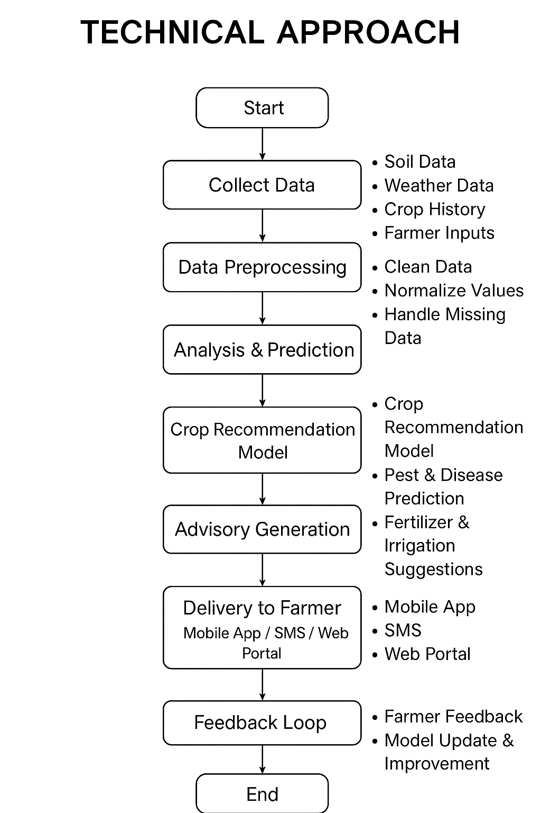

# Smart India Hackathon Workshop
# Date:28/09/2025
## Register Number:25014536
## Name:SURYA PRAKASH S
## Problem Title
SIH 25010: Smart Crop Advisory System for Small and Marginal Farmers
## Problem Description
A majority of small and marginal farmers in India rely on traditional knowledge, local shopkeepers, or guesswork for crop selection, pest control, and fertilizer use. They lack access to personalized, real-time advisory services that account for soil type, weather conditions, and crop history. This often leads to poor yield, excessive input costs, and environmental degradation due to overuse of chemicals. Language barriers, low digital literacy, and absence of localized tools further limit their access to modern agri-tech resources.

Impact / Why this problem needs to be solved

Helping small farmers make informed decisions can significantly increase productivity, reduce costs, and improve livelihoods. It also contributes to sustainable farming practices, food security, and environmental conservation. A smart advisory solution can empower farmers with scientific insights in their native language and reduce dependency on unreliable third-party advice.

Expected Outcomes

• A multilingual, AI-based mobile app or chatbot that provides real-time, location-specific crop advisory.
• Soil health recommendations and fertilizer guidance.
• Weather-based alerts and predictive insights.
• Pest/disease detection via image uploads.
• Market price tracking.
• Voice support for low-literate users.
• Feedback and usage data collection for continuous improvement.

Relevant Stakeholders / Beneficiaries

• Small and marginal farmers
• Agricultural extension officers
• Government agriculture departments
• NGOs and cooperatives
• Agri-tech startups

Supporting Data

• 86% of Indian farmers are small or marginal (NABARD Report, 2022).
• Studies show ICT-based advisories can increase crop yield by 20–30%.

## Problem Creater's Organization
Government of Punjab

## Theme
Agriculture, FoodTech & Rural Development

## Proposed Solution
<ul><li>A multilingual, AI-based mobile app and chatbot that gives small and marginal farmers real-time, location-specific crop advice.It offers Personalized crop, soil, and fertilizer recommendations,Weather alerts and predictive insights.
Pest/disease detection through image uploads,Market price updates,Voice support for low-literate users.Combines AI, weather data, market insights, and regional language voice support in one simple platform, making it highly accessible and impactful for farmers.</ul></li>

## Technical Approach
<ul><li>The solution will be developed as a multilingual, voice-enabled mobile application with a simple user interface, supported by a cloud-based backend using Python/Django for data management and APIs. AI/ML models will power image recognition for pest and disease detection, along with predictive analytics for weather and crop yield. The system will integrate data from government APIs, satellite sources, soil reports, and market databases, with optional IoT sensor support for soil health. It will be deployed on scalable cloud infrastructure and include offline mode to ensure usability in low-connectivity rural areas.

</ul></li>

## Feasibility and Viability
<ul><li>The solution is highly feasible as it leverages existing technologies like mobile apps, AI/ML models, cloud platforms, and government data APIs, all of which are readily available and cost-effective. Its viability lies in addressing farmers’ real challenges—low literacy, lack of localized advisory, and limited resources—through a simple, voice-enabled, multilingual interface. Potential challenges include connectivity issues, farmer adoption, and data accuracy, which can be mitigated through offline support, awareness campaigns, and continuous data validation. The system is scalable across regions, making it both sustainable and impactful in the long term.</ul></li>

## Impact and Benefits
<ul><li>The Smart Crop Advisory System will empower small and marginal farmers to make informed decisions, leading to higher crop yields, reduced input costs, and improved livelihoods. By promoting sustainable farming practices, it will help conserve soil and water, reduce chemical overuse, and enhance food security. Voice-enabled, multilingual access ensures inclusivity for low-literate farmers, while real-time alerts, pest detection, and market insights increase efficiency and profitability. Overall, it creates a positive social, economic, and environmental impact, benefiting farmers, agricultural stakeholders, and the broader community.al,etc.</ul></li>

## Research and References
<ul><li>The solution is supported by multiple sources, including the NABARD Report 2022, which states that 86% of Indian farmers are small or marginal, and studies showing that ICT-based advisories can increase crop yields by 20–30%. Additional references include government agriculture data and APIs for soil, weather, and market prices, as well as relevant AI/ML research on pest and disease detection and predictive analytics, ensuring that the solution is grounded in credible data and proven technologies.
Framer Community: https://www.framer.com/community — Connect with other designers and developers.
Framer Blog: https://www.framer.com/blog — Updates, tutorials, and product announcements.
</ul></li>
